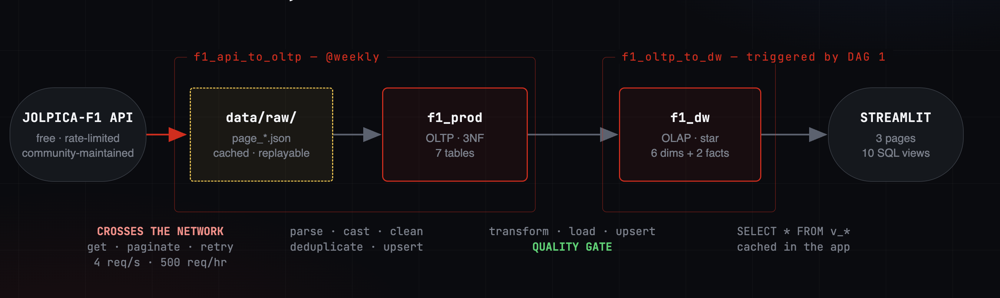
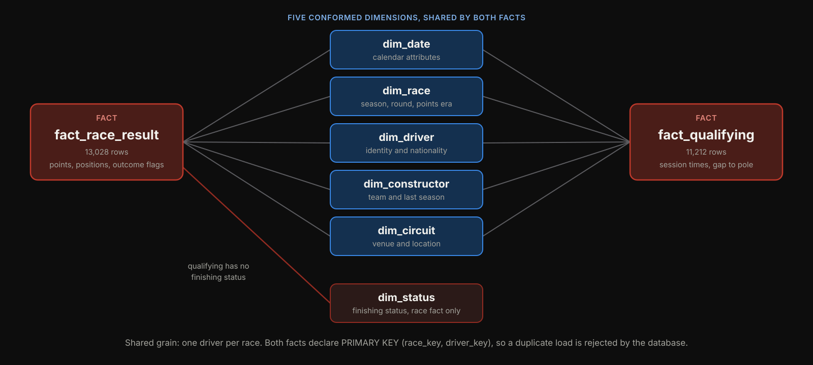
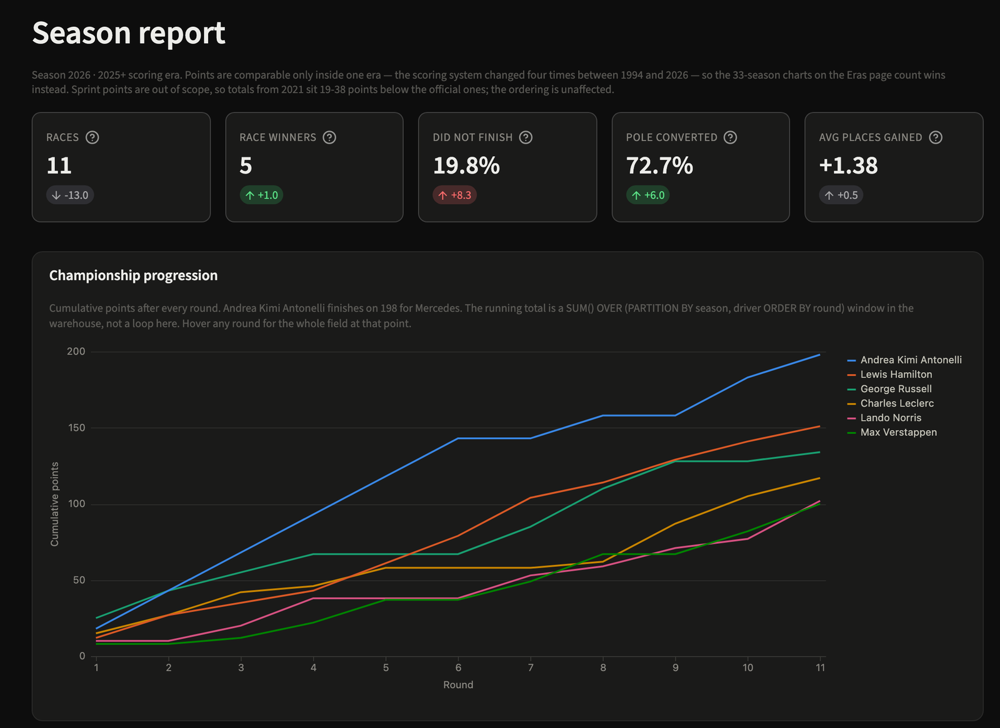
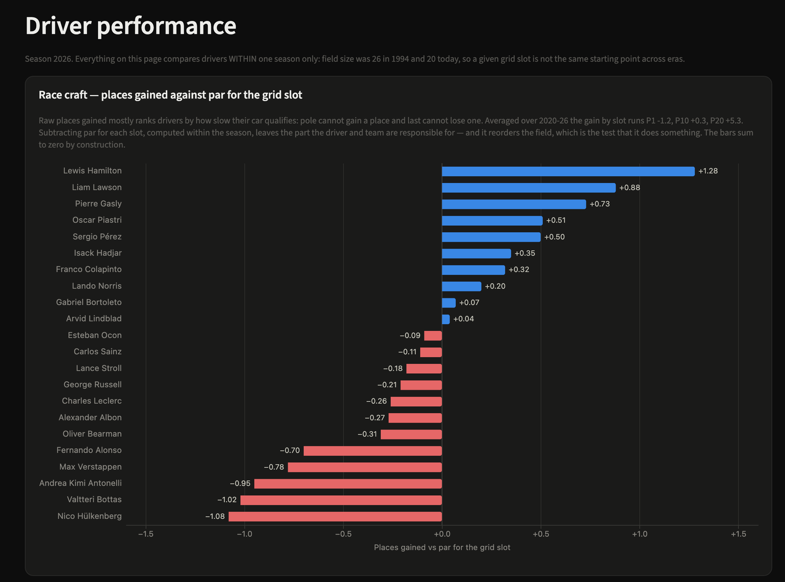
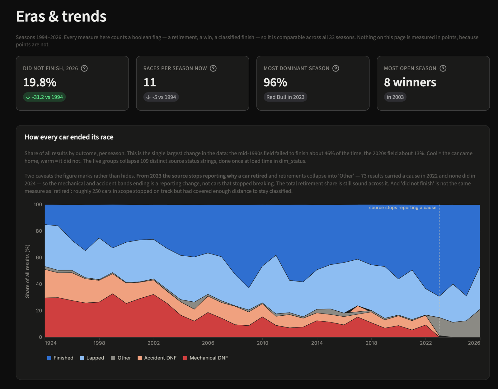

# Formula 1 Data Warehouse

An end-to-end data engineering project that transforms 1994-2026 Jolpica Formula 1 records into a
validated fact constellation and reusable analytical layer, orchestrated with Airflow and explored
through Streamlit.

Python · PostgreSQL 16 · Apache Airflow · Docker · Streamlit · SQL

## Why this project

Formula 1 results are public, but the API that serves them is event-oriented: one request returns
one race, in nested JSON, shaped for display rather than for analysis. Results, qualifying,
drivers, constructors, circuits and finishing statuses arrive as separate endpoints with no stable
join between them, so even a simple question needs several requests and a lot of glue code before
any analysis begins.

Cross-era analysis needs more than joins. The warehouse spans four scoring eras between 1994 and
2026, qualifying moved to a knockout format in 2006, seasons grew from 16 rounds to 24, and source
coverage varies by era. Comparing a 1994 season to a 2026 one requires measures that mean the same
thing in both, defined once and reused everywhere rather than reinvented per query.

This project builds that layer:

- A cached raw landing zone holding every API page as JSON on disk.
- `f1_prod`, a normalized (3NF) OLTP database that resolves the entities and their keys.
- `f1_dw`, an analytical fact constellation: two fact tables sharing conformed dimensions.
- Ten SQL views that define every published metric.
- A three-page Streamlit dashboard that reads those views and nothing else.

## Project at a glance

| Seasons | Races | Race results | Qualifying rows | Dimensions | Facts | Views | Dashboard pages |
|--------:|------:|-------------:|----------------:|-----------:|------:|------:|----------------:|
| 33 | 612 | 13,028 | 11,212 | 6 | 2 | 10 | 3 |

Coverage runs 1994 to 2026, the 2026 season complete through 26 July.

## Architecture

One end-to-end pipeline split into two independently rerunnable ETL stages and Airflow DAGs.

<p align="center">
  <a href="diagrams/architecture_presentation.png">
    
  </a>
</p>

- `data/raw/` is the network boundary. Only the extraction task calls the API; every stage after it
  reads files from disk, so parse, load and the whole warehouse run offline and a rerun costs
  nothing.
- `f1_prod` is the validated handoff between the two DAGs. `f1_api_to_oltp` ends with `check_oltp`,
  which fails the run if any row was dropped for an unresolvable foreign key.
- `f1_api_to_oltp` runs weekly and processes the current season by default. `refresh=true`
  refetches only the endpoints that grow, the four reference tables and the season still being run;
  `refresh=false` guarantees a cached, offline run.
- `should_trigger_dw` is a short-circuit task reading the `trigger_dw` parameter, and `trigger_dw`
  fires `f1_oltp_to_dw` through a `TriggerDagRunOperator` after a successful validated OLTP load,
  including when the upserts produce no changes. DAG 1 does not wait for DAG 2 to finish.
- `f1_oltp_to_dw` has `schedule=None`, so it has no clock of its own and can also be triggered
  manually, with `full_reload` when the warehouse should be rebuilt from all history.

## Data model

<p align="center">
  <a href="diagrams/readme/data-model.svg">
    
  </a>
</p>

A fact constellation, meaning two fact tables that share the same dimension tables. Five dimensions
are conformed across both facts, which is what lets one query compare qualifying pace against race
outcome. `dim_status` joins the race fact only, because a qualifying session has no finishing
status.

Results and qualifying stay separate because they are different business processes with disjoint
measures: 16 race-only columns against 9 qualifying-only, and different coverage, since 83 races in
scope have results but no qualifying data. Merged into one table with a session flag, most measure
columns would be null by construction and `q3_ms IS NULL` would stop meaning "eliminated in Q2".
Conformed dimensions keep cross-process analysis available without paying that cost.

[View the complete OLTP ERD](diagrams/oltp_erd.png) ·
[View the complete warehouse ERD](diagrams/olap_star.png) ·
[Technical reference](docs/technical-reference.md)

## Engineering highlights

### Replayable ingestion

A paginated API client enforces its own rate limit with a dual token bucket, 4 requests per second
and 500 per hour, rather than reacting to HTTP 429s. Every page is written to `data/raw/` and
served from there on later runs. Closed seasons are immutable and stay cached; selective refresh
covers the reference endpoints and the active season, and a page whose refetch fails falls back to
its cached copy, so an offline run still succeeds.

### Idempotent loading

Every OLTP table carries a surrogate key and a unique natural key; the natural key is the
`ON CONFLICT` target. Warehouse facts conflict on the stable source id rather than the surrogate
pair, which also serves as the lineage trail back to `f1_prod`. Batches are deduplicated before
insert. A second run lands on identical row counts, and a result restated weeks later updates the
existing row instead of being ignored.

### Incremental warehouse loading

The two facts keep independent watermarks. Incremental extraction starts from
`MAX(race_date) - 30 days`, and that overlap is what captures recent corrections already present in
`f1_prod`, such as a disqualification applied after the race. Corrections older than the window
need a full or targeted reload. `full_reload=true` widens the fact extraction to all history;
dimensions load at full scope in both modes, because attributes like `race_laps` and `last_season`
are wrong if computed over a partial window.

### Quality gates

`check_oltp` validates the OLTP handoff on row counts, dropped rows and the finishing-position
integrity rule. In the warehouse stage the checks run inside the fact task and before any write, so
a failure leaves the facts untouched: 7 checks always, 3 more on a full reload, and 3 warnings for
documented source anomalies. Failures raise a dedicated `DataQualityError` so bad data is
distinguishable from a database outage, and the checks return verdicts rather than repairing rows.
A post-load verification then asserts the row counts and fails on an empty dimension.

## Selected analytical findings

**Cars became far more reliable.** The share of results ending in a DNF fell from 46.4% across
1994-1999 to 12.9% across 2020-2026. The recent period is partial, running through 26 July 2026,
and DNF uses the warehouse `is_dnf` definition, which is not identical to "retired": some cars stop
on track having covered enough distance to stay classified. The cause of a retirement is not
comparable across the whole range, because Jolpica stops consistently reporting retirement causes
after 2022 and increasingly returns the generic status `Retired`.

**Dominance swings, and it is measured in wins.** Red Bull won 95.5% of the Grands Prix in 2023 and
37.5% in 2024. Dominance uses win share rather than points share so that it compares across scoring
eras: a win is one race in every season, while a win was worth 10 points in 1994 and 25 today.

**Places gained is mostly a grid artifact until it is adjusted.** Averaged over 2020-2026, raw
places gained runs about -1.2 from pole and +5.3 from P20, because pole cannot gain a place and
last cannot lose one. The warehouse subtracts the season-specific expectation for each grid slot
and keeps the residual, which reorders the field. Treat it as a performance proxy that removes
structural starting-position bias, not as pure driver skill: it still reflects car pace, strategy,
reliability and race incidents.

<details>
<summary>The ten analytical views</summary>

All ten live in `sql/analytics/001_views.sql`.

| View | Question it answers |
|---|---|
| `v_season_kpis` | What does one season look like at a glance? |
| `v_constructor_season` | How did each team's season go? |
| `v_driver_season` | Who won it, and what was the season made of? |
| `v_championship_progression` | Who led the title race, and when did it turn? |
| `v_driver_rolling_form` | Is a driver trending up or down? |
| `v_reliability_trend` | How did cars finish, season by season? |
| `v_quali_vs_race` | How does qualifying pace convert into race results? |
| `v_driver_race_craft` | Who gains places against par for their grid slot? |
| `v_season_competitiveness` | How dominant was the strongest team? |
| `v_circuit_profile` | Which circuits are hardest on cars? |

</details>

## Dashboard

All metrics are defined in ten SQL views. Streamlit reads, caches and visualizes those results
without redefining aggregations in pandas. The connection is read-only, enforced by the server
rather than by convention.

### Season report

One season top to bottom: headline KPIs with year-on-year deltas, the championship as it developed
round by round, constructor points, the composition of each driver's season, and the full
standings table.

<p align="center">
  <a href="diagrams/dashboard_1_season.png">
    
  </a>
</p>

### Driver performance

Driver comparison within a single season: grid-adjusted race craft, rolling form over a five-race
window, and a result grid showing the raw finishing pattern behind both.

<p align="center">
  <a href="diagrams/dashboard_2_drivers.png">
    
  </a>
</p>

### Eras and trends

All 33 seasons at once: how every car ended its race, how concentrated wins were in the strongest
team, and which circuits break cars.

<p align="center">
  <a href="diagrams/dashboard_3_eras.png">
    
  </a>
</p>

## Validation and performance

Each item below was exercised against the live database.

- Full load verified: all six dimensions and both facts, in about 1.6 seconds.
- Idempotent rerun verified: a second run produces identical row counts and zero skipped rows.
- Incremental recovery verified: watermark plus 30-day lookback picks up a late correction.
- Full reload verified: every table truncated, one command restores a complete warehouse including
  the seeded unknown members and all 12,053 date rows.
- Quality-gate failure verified: seven classes of deliberately corrupted input each stopped the
  load with the failing check named and nothing written.
- Known source anomalies preserved as warnings rather than silently repaired: 83 races with results
  but no qualifying, 4 duplicate grid positions from penalty renumbering, 5 duplicate qualifying
  positions from deleted times.

Four indexes ship in `sql/analytics/002_indexes.sql`. Timings are medians of seven runs after two
warmups.

| Operation | Before | After |
| --------- | -----: | ----: |
| Watermark lookup | 1.410 ms | 0.007 ms |
| 30-day lookback | 0.548 ms | 0.011 ms |
| Driver history | 0.164 ms | 0.019 ms |

Selective warehouse queries benefited from indexes, while full-view aggregations did not. A view
aggregates the whole fact and reads every row by definition, so no index can help it. Dashboard
responsiveness therefore relies on cached analytical results rather than unnecessary indexes, and
three of the seven candidate indexes were removed on the evidence.

## Quick start

Prerequisites: Docker Desktop, Python 3.13, Git.

```bash
# 1. clone, create the virtualenv and configure the environment
git clone <repository-url> f1-dwh && cd f1-dwh
python3.13 -m venv .venv
./.venv/bin/pip install -r requirements.txt
cp .env.example .env

# 2. start PostgreSQL 16 on localhost:5433 (creates f1_prod and f1_dw)
docker compose up -d

# 3. OLTP schema, then fill it from the API
./.venv/bin/python scripts/run_migrations.py --target oltp
./.venv/bin/python scripts/backfill.py --smoke      # one season, validates the path
./.venv/bin/python scripts/backfill.py              # full 1994-2026 range

# 4. warehouse and analytics schemas, then load f1_dw from f1_prod
./.venv/bin/python scripts/run_migrations.py --target olap
./.venv/bin/python scripts/pipeline.py --full-reload
./.venv/bin/python scripts/run_migrations.py --target analytics

# 5. dashboard on http://localhost:8501
./.venv/bin/streamlit run dashboard/app.py

# 6. optional: Airflow on http://localhost:8080
docker compose -f docker-compose.airflow.yml up -d
```

A cold historical extraction makes roughly 110 to 140 rate-limited API requests against a free
service, so step 3 takes a few minutes. Everything after it is offline. Rerunning
`scripts/pipeline.py` with no flag performs an incremental load.

Airflow is optional; the pipeline runs without it. In the UI, `f1_api_to_oltp` is the weekly
ingestion DAG and `f1_oltp_to_dw` is the externally triggered warehouse DAG. Trigger the warehouse
DAG by hand with the configuration `{"full_reload": true}` to rebuild the facts from all history,
which is what a `scripts/backfill.py` load needs, since that writes `f1_prod` outside Airflow.

## Repository structure

```text
.
├── dags/               Airflow orchestration: f1_api_to_oltp, f1_oltp_to_dw
├── dashboard/          Streamlit app: app.py, db.py, theme.py, screens/, charts/
├── data/raw/           Cached API landing zone (gitignored, created on first run)
├── diagrams/           Architecture, ERDs and dashboard screenshots
├── docker/init/        First-boot SQL that creates f1_prod and f1_dw
├── docs/               Technical reference
├── etl/
│   ├── extract/        Jolpica client and landing-zone policy
│   ├── oltp/           Parsing and normalized loading
│   └── olap/           Warehouse extract, transform, quality, load
├── scripts/            Migrations, backfill, pipeline, checks, EXPLAIN harness
├── sql/
│   ├── oltp/           3NF schema
│   ├── olap/           Fact-constellation schema
│   ├── analytics/      Views and measured indexes
│   └── checks/         Standalone sanity queries
├── docker-compose.yml
└── docker-compose.airflow.yml
```

## Scope and limitations

- Results and qualifying only. No sprint races, telemetry, pit stops or lap-level data.
- Championship totals from 2021 onward exclude sprint points, so they sit below the official
  totals; the ordering is unaffected.
- The 30-day incremental lookback misses corrections older than the window unless a full or
  targeted reload is performed.
- Jolpica provides no `updated_at`, change feed or change-data-capture mechanism, so a date
  watermark plus overlap is the available strategy.
- Cause-specific retirement reporting becomes inconsistent after 2022, so retirement totals remain
  comparable across eras while the split into causes does not.
- Dimensions are not history-tracking, so an attribute change overwrites the previous value.
- Local Docker deployment only. There is no cloud deployment.
