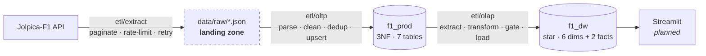
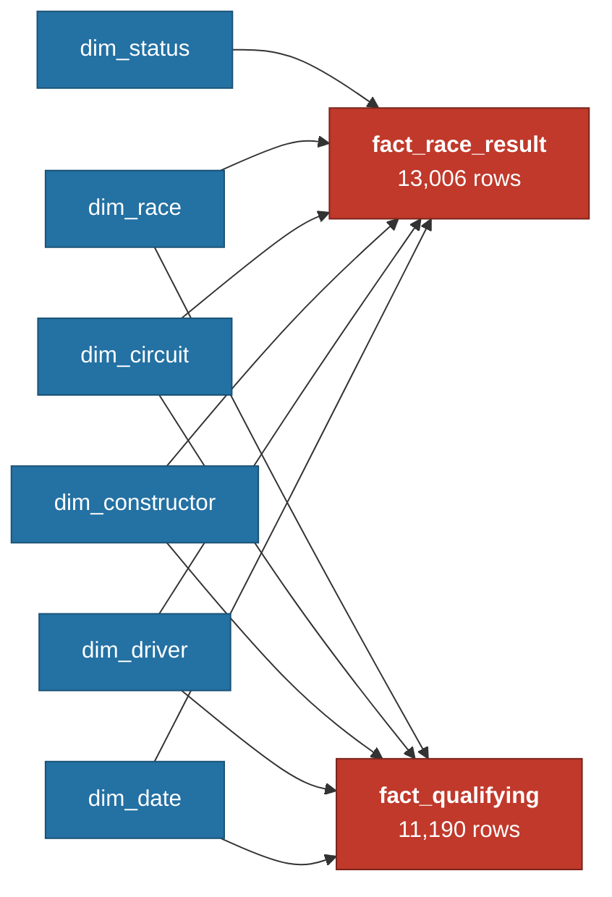
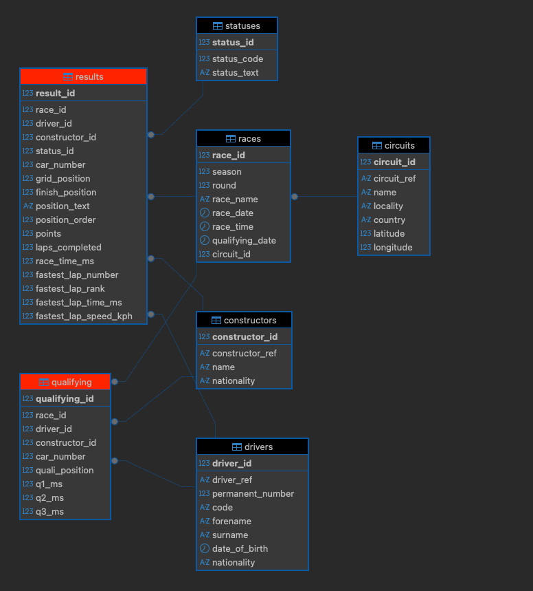
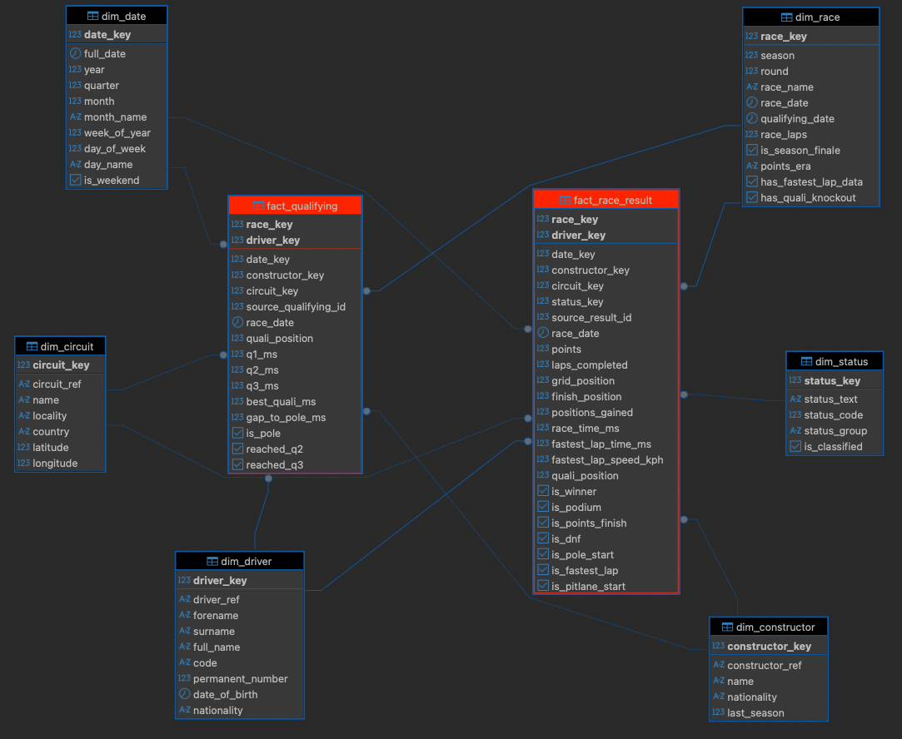
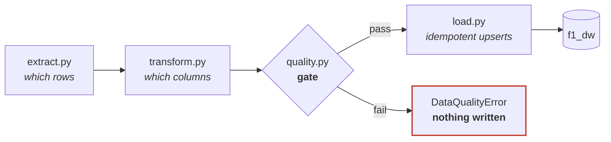

# F1 Data Warehouse

A dimensional warehouse over 33 seasons of Formula 1, built from the Jolpica-F1 API:
raw JSON → normalised OLTP (`f1_prod`) → star-schema warehouse (`f1_dw`).

Here is a question it answers that a normalised database makes awkward — **have F1 cars actually
got more reliable?**

| Decade | Races | DNF rate | of which mechanical |
|---|---:|---:|---:|
| 1990s | 98 | **46.4%** | 28.8% |
| 2000s | 174 | 30.2% | 19.3% |
| 2010s | 198 | 17.8% | 10.5% |
| 2020s | 141 | **12.9%** | **3.4%** |

Nearly half the field used to fail to finish. Today it is one in eight, and mechanical failures
have all but vanished. That query is a single scan of one fact table joined to two dimensions,
because the flags and status groupings are computed once at load time.

**33 seasons** (1994–2026) · **611 races** · **13,006 results** · **11,190 qualifying** ·
**6 dimensions** · **2 facts**

---

## Status

| Stage | State |
|---|---|
| API → raw JSON → `f1_prod` (3NF) | **Built, loaded, verified** |
| `f1_prod` → `f1_dw` (star schema) | **Built, loaded, verified** |
| Analytics views + indexes | Next |
| Streamlit dashboard | Planned |
| Airflow orchestration | Planned |

---

## Architecture



**The landing zone is a hard boundary.** Once JSON is on disk nothing downstream touches the
network — parse, load and the whole warehouse pipeline run fully offline. Re-runs never re-hit the
API, so development is fast and a demo works without wifi.

These are **two separate ETLs**, not one long chain. The raw files are the seam.

---

## Run it

Requires Docker and Python 3.13.

```bash
# 1. deps + database
./.venv/bin/pip install -r requirements.txt
cp .env.example .env
docker compose up -d                                   # Postgres 16 on localhost:5433

# 2. OLTP schema, then fill it from the API (~110-140 requests, rate-limited)
./.venv/bin/python scripts/run_migrations.py --target oltp
./.venv/bin/python scripts/backfill.py --smoke         # one season first, validates the path
./.venv/bin/python scripts/backfill.py                 # full 1994-2026

# 3. warehouse schema, then load it from f1_prod (~2 seconds, no network)
./.venv/bin/python scripts/run_migrations.py --target olap
./.venv/bin/python scripts/pipeline.py --full-reload
```

Then connect DBeaver to `localhost:5433`, database `f1_dw`, user/password from `.env`.

Run `scripts/pipeline.py` with no flag for an incremental load — it reads a watermark from the fact
table and only re-reads recent races.

---

## The data model

**Grain: one row per driver, per race** — in both facts, enforced as
`PRIMARY KEY (race_key, driver_key)` rather than merely intended.



A **fact constellation**: five dimensions are shared by both facts, which is what lets a single
query compare qualifying pace against race outcome. `dim_status` sits on the race fact only —
qualifying has no finishing status.

**Why two facts and not one with a `session_type` flag?** The measures are disjoint — 16
race-only columns, 9 qualifying-only, zero overlap. Merged, every row would leave roughly 60% of
its measure columns null by construction, and `q3_ms IS NULL` would stop meaning "eliminated in
Q2" and start also meaning "this is a race row".

### OLTP — 3NF, 7 tables


### Warehouse — star schema


---

## The pipeline



Four modules with one responsibility each — **extract decides which rows, transform decides which
columns, quality asserts the promise, load writes.**

- **`extract.py`** reads `f1_prod`. Dimension queries filter to participating entities only
  (`WHERE EXISTS`), and derive every dimension attribute in SQL, so each dimension is one
  self-contained query.
- **`transform.py`** handles the two facts only: resolve surrogate keys, compute derived measures
  and the pre-computed flags.
- **`quality.py`** returns verdicts and **never repairs**. A gate that quietly drops a bad row
  makes its own check unfalsifiable. 7 checks always, 3 more on a full reload, 3 warnings for
  documented source quirks.
- **`load.py`** upserts on natural and source keys, so a second run updates in place.

**Idempotency is the headline property.** Run the pipeline twice and the row counts are identical.
Every conflict target is a natural or source key and every conflict does `DO UPDATE`, so a result
the FIA restates weeks later actually corrects the warehouse row instead of being ignored.

---

## Five decisions worth defending

Full reasoning lives in `documentation/CLAUDE.md`.

1. **Dimensions hold participating entities only** — 177 of 881 drivers, 49 of 214 constructors.
   The excluded rows are entities whose entire career falls outside 1994–2026; the API's reference
   endpoints are all-time.
2. **There is no `first_season` or `debut_season`.** `f1_prod` starts at 1994, so `MIN(season)`
   would report 1994 for the 46 drivers and 14 constructors who raced before then — Schumacher
   really debuted in 1991, Ferrari in 1950. A column is left-censored exactly when it asks *"when
   did this start?"* of a source that begins mid-history.
3. **Raw points are comparable within an era only.** The scoring system changed four times across
   33 seasons, so a stacked bar chart of points would silently add ten-point wins to twenty-five
   point wins. Cross-era comparison uses the boolean flags, which mean the same thing in 1994 as
   in 2026.
4. **Migrations contain no `INSERT`.** They run once and are then skipped by the ledger, so
   anything they insert is unrecoverable after a `TRUNCATE`. The `-1` unknown members and the
   `dim_date` populate come from `load.py`, so a truncate-and-reload restores a complete warehouse.
5. **Facts conflict on the source id, not the surrogate pair.** Surrogate keys are reassigned if a
   dimension is ever rebuilt; `source_result_id` is stable and doubles as the lineage trail back
   to `f1_prod`.

---

## Verified

Not claimed — measured, on the live database.

- **Full load in ~1.6s**: 13,006 + 11,190 fact rows, all six dimensions.
- **Idempotent**: second run → identical counts, zero rows skipped.
- **Incremental**: watermark-driven, with a 30-day lookback so a late disqualification is still
  picked up.
- **Truncate-and-reload**: every table emptied, one command restores all 12,053 date rows and all
  six unknown members.
- **The gate halts**: seven classes of deliberately corrupted input each stopped the load with the
  failing check named.
- **Source anomalies preserved**, not silently fixed: 83 races with results but no qualifying
  (pre-2003 coverage), 4 duplicate grid positions (penalty renumbering), 5 duplicate qualifying
  positions (deleted times). These warn; they do not fail.

---

## Out of scope

Cut deliberately: FastF1 / telemetry / lap data, pit stops, sprint races, SCD Type 2, dbt, cloud
deployment, ML.

---

## Layout

```
docker-compose.yml          postgres:16; creates f1_prod + f1_dw
docker/init/                first-boot SQL
sql/
  oltp/001..007_*.sql       3NF migrations
  olap/001..008_*.sql       star-schema DDL — structure only, no INSERTs
  checks/oltp_sanity.sql    DBeaver sanity checks
etl/
  config.py                 env-driven config: prod_dsn() / dw_dsn(), paths, seasons, rate limits
  db.py                     get_conn() + transaction() context manager
  logging_config.py         file + console logging with row counts and timings
  extract/jolpica.py        rate-limited API client (dual token bucket), raw JSON landing
  oltp/                     API -> f1_prod:  parse.py, load.py
  olap/                     f1_prod -> f1_dw: extract.py, transform.py, quality.py, load.py
scripts/
  run_migrations.py         --target {oltp,olap}; each DB keeps its own ledger
  backfill.py               API -> raw -> f1_prod; --smoke / --season
  pipeline.py               f1_prod -> f1_dw; --full-reload / incremental
  check_oltp.py             row counts + integrity checks; non-zero exit on FAIL
diagrams/                   ER diagrams and architecture visuals
```

Logs are written to `logs/` and echoed to the console, with per-stage timings and row counts.
