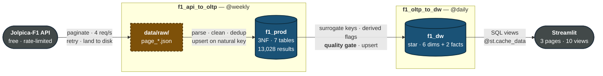
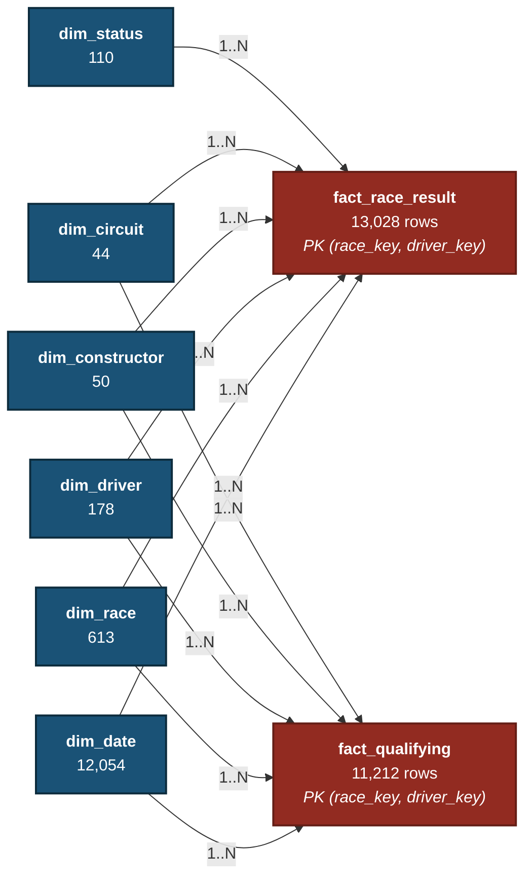
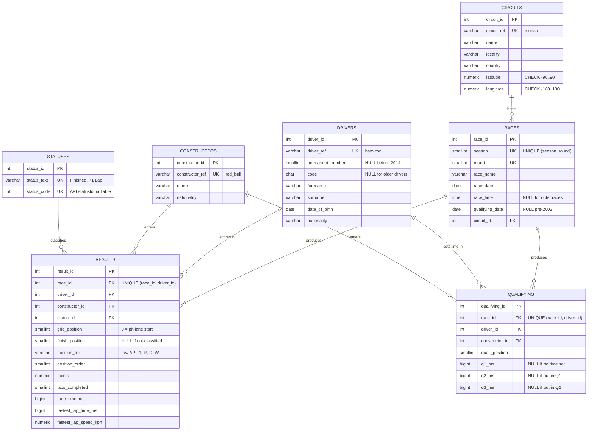
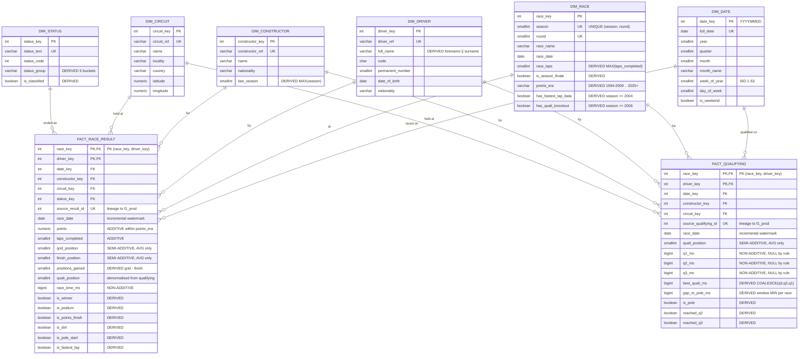
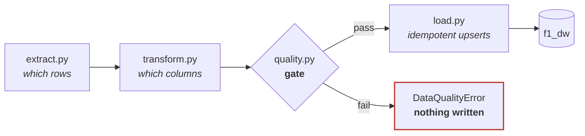
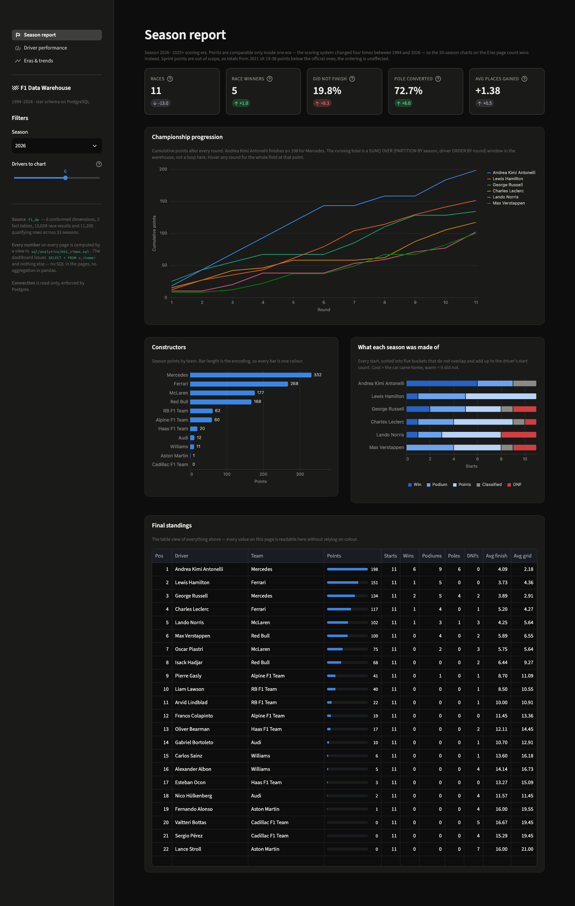
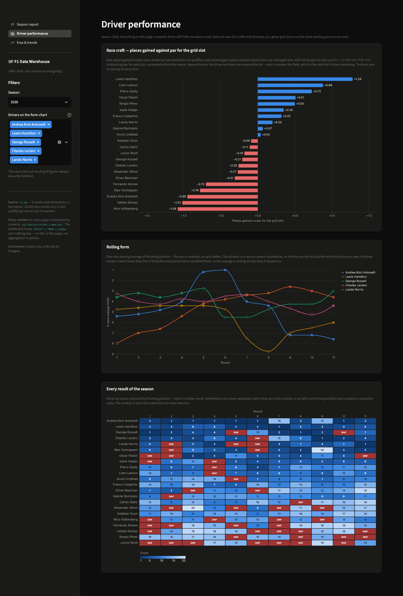
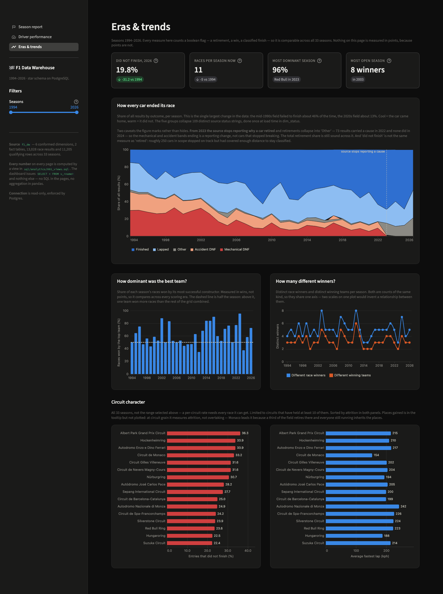

# F1 Data Warehouse

A dimensional warehouse over 33 seasons of Formula 1, built from the Jolpica-F1 API:
raw JSON → normalised OLTP (`f1_prod`) → star-schema warehouse (`f1_dw`).

Here is a question it answers that a normalised database makes awkward — **have F1 cars actually
got more reliable?**

| Decade | Races | DNF rate | of which mechanical |
|---|---:|---:|---:|
| 1990s | 98 | **46.4%** | 28.8% |
| 2000s | 174 | 30.2% | 19.3% |
| 2010s | 198 | 17.8% | 10.5% |
| 2020s | 142 | **12.9%** | **3.4%** |

Nearly half the field used to fail to finish. Today it is one in eight, and mechanical failures
have all but vanished. That query is a single scan of one fact table joined to two dimensions,
because the flags and status groupings are computed once at load time.

**33 seasons** (1994–2026) · **612 races** · **13,028 results** · **11,212 qualifying** ·
**6 dimensions** · **2 facts**

---

## Status

| Stage | State |
|---|---|
| API → raw JSON → `f1_prod` (3NF) | **Built, loaded, verified** |
| `f1_prod` → `f1_dw` (star schema) | **Built, loaded, verified** |
| Analytics views + indexes | **Built, measured** |
| Streamlit dashboard | **Built** |
| Airflow orchestration | **Built, verified** |

---

## Architecture



`data/raw/` is drawn dashed because it is the network boundary, and each subgraph is one DAG.

**The landing zone is a hard boundary.** Once JSON is on disk nothing downstream touches the
network — parse, load and the whole warehouse pipeline run fully offline. Re-runs never re-hit the
API, so development is fast and a demo works without wifi.

These are **two separate ETLs**, not one long chain. The raw files are the seam.

---

## Run it

Requires Docker and Python 3.13.

```bash
# 1. deps + database
./.venv/bin/pip install -r requirements.txt
cp .env.example .env
docker compose up -d                                   # Postgres 16 on localhost:5433

# 2. OLTP schema, then fill it from the API (~110-140 requests, rate-limited)
./.venv/bin/python scripts/run_migrations.py --target oltp
./.venv/bin/python scripts/backfill.py --smoke         # one season first, validates the path
./.venv/bin/python scripts/backfill.py                 # full 1994-2026

# 3. warehouse schema, then load it from f1_prod (~2 seconds, no network)
./.venv/bin/python scripts/run_migrations.py --target olap
./.venv/bin/python scripts/pipeline.py --full-reload

# 4. analytics views + indexes, then the dashboard
./.venv/bin/python scripts/run_migrations.py --target analytics
./.venv/bin/streamlit run dashboard/app.py            # http://localhost:8501

# 5. orchestration (optional; the pipeline runs fine without it)
docker compose -f docker-compose.airflow.yml up -d    # http://localhost:8080
```

The Airflow compose file pins `name: f1-airflow`. That is load-bearing, not cosmetic: Compose
derives a project name from the directory, so without it this file and `docker-compose.yml` are
the same project — and since both define a `postgres` service, starting Airflow would replace the
F1 database container with Airflow's metadata database.

Then connect DBeaver to `localhost:5433`, database `f1_dw`, user/password from `.env`.

Run `scripts/pipeline.py` with no flag for an incremental load — it reads a watermark from the fact
table and only re-reads recent races.

---

## The data model

**Grain: one row per driver, per race** — in both facts, enforced as
`PRIMARY KEY (race_key, driver_key)` rather than merely intended.



A **fact constellation**: five dimensions are shared by both facts, which is what lets a single
query compare qualifying pace against race outcome. `dim_status` sits on the race fact only —
qualifying has no finishing status.

**Why two facts and not one with a `session_type` flag?** The measures are disjoint — 16
race-only columns, 9 qualifying-only, zero overlap. Merged, every row would leave roughly 60% of
its measure columns null by construction, and `q3_ms IS NULL` would stop meaning "eliminated in
Q2" and start also meaning "this is a race row".

### OLTP — 3NF, 7 tables

Every table carries a surrogate `SERIAL` primary key **and** a `UNIQUE` natural key. The natural
key is the `ON CONFLICT` target that makes every load idempotent; the surrogate key is what the
foreign keys point at.



**Reading the cardinality.** `RACES ||--|{ RESULTS` is **one-or-more**, not zero-or-more, and that
is enforced by the loader rather than the DDL: a scheduled season lists future rounds that have no
results yet, and `load_races(run_keys=...)` holds them back until they have been run. So a race row
never exists without at least one result. Every other relationship is zero-or-more — a driver or
circuit can exist in the reference data without yet appearing in a race.

`chk_results_finish` additionally enforces that `finish_position` is NULL *exactly* when
`position_text` is non-numeric, so "did not finish" cannot disagree with itself.

### Warehouse — star schema



**Two things the diagram is deliberately showing.** `circuit_key` sits on both *facts*, not on
`dim_race` — putting it there would snowflake the model and make every circuit query a two-hop
join. And the grain is declared as a composite primary key, `PRIMARY KEY (race_key, driver_key)`,
so a duplicate load is rejected by the database rather than merely avoided by the ETL.

---

## The pipeline



Four modules with one responsibility each — **extract decides which rows, transform decides which
columns, quality asserts the promise, load writes.**

- **`extract.py`** reads `f1_prod`. Dimension queries filter to participating entities only
  (`WHERE EXISTS`), and derive every dimension attribute in SQL, so each dimension is one
  self-contained query.
- **`transform.py`** handles the two facts only: resolve surrogate keys, compute derived measures
  and the pre-computed flags.
- **`quality.py`** returns verdicts and **never repairs**. A gate that quietly drops a bad row
  makes its own check unfalsifiable. 7 checks always, 3 more on a full reload, 3 warnings for
  documented source quirks.
- **`load.py`** upserts on natural and source keys, so a second run updates in place.

**Idempotency is the headline property.** Run the pipeline twice and the row counts are identical.
Every conflict target is a natural or source key and every conflict does `DO UPDATE`, so a result
the FIA restates weeks later actually corrects the warehouse row instead of being ignored.

---

## The analytics layer

Ten views in `sql/analytics/001_views.sql` back a three-page Streamlit dashboard. The dashboard
issues `SELECT * FROM v_<name>` and nothing else — every aggregation is in the warehouse, and the
pages filter the cached result in pandas.

| View | Question | Technique |
|---|---|---|
| `v_season_kpis` | What does a season look like at a glance? | Flag sums — one scan, no `CASE` |
| `v_constructor_season` | Is the sport competitive or dominated? | Season × constructor grain |
| `v_driver_season` | Who won it, and what was their season made of? | Season × driver; disjoint outcome buckets |
| `v_championship_progression` | Who led the title race, and when did it turn? | `SUM() OVER (PARTITION BY season, driver ORDER BY round)` |
| `v_driver_rolling_form` | Is a driver trending up or down? | `ROWS BETWEEN 4 PRECEDING AND CURRENT ROW` |
| `v_reliability_trend` | Have cars got more reliable over 33 seasons? | Aggregate nested in a window |
| `v_quali_vs_race` | Both facts on their shared grain | `INNER JOIN` on `(race_key, driver_key)` |
| `v_driver_race_craft` | Who *actually* gains places on Sunday? | Residual against a per-grid-slot baseline |
| `v_season_competitiveness` | How dominant was the strongest team? | Win share, so it compares across scoring eras |
| `v_circuit_profile` | Which circuits break cars? | The query that earns `dim_circuit` |

`v_driver_race_craft` is the one worth a second look. Plotting places gained directly is nearly
meaningless: averaged over 2020–2026 it runs **−1.2 at pole and +5.3 from P20**, perfectly
monotonic, because pole cannot gain a place and last cannot lose one. So a raw ranking mostly sorts
drivers by how slow their car is over one lap. Subtracting par for the grid slot leaves the part the
driver and team own — and it reorders the field, which is the test that it does something: Pérez in
2026 falls from **+4.14 raw to +0.49 adjusted**, while Hamilton rises to **+1.76** from slots that
normally lose places. The residuals sum to exactly zero within a season, so the baseline checks
itself.

`v_constructor_season` exists because the KPI cards need a season grain while the constructor chart
needs a constructor grain. One view cannot be both without a `groupby` in the dashboard, which
would defeat the purpose of having a warehouse. `v_driver_season` is its mirror at driver grain.

`v_season_competitiveness` measures dominance in **wins rather than points**, and that is the
whole reason it works across 33 seasons: the scoring system changed four times in scope, so a
points share means something different in each era while a race win does not. The per-season
denominator comes from `SUM(wins) OVER (PARTITION BY season)`, which is exact because every race
has precisely one winner.

### What indexing actually did

Four indexes, not the seven originally planned. All seven were built and measured; three were
removed on the evidence, and `sql/analytics/002_indexes.sql` records each rejection with the
measurement that caused it.

| Query | Before | After | Change |
|---|---:|---:|---:|
| `MAX(race_date)` — the ETL watermark | 1.410 ms | 0.007 ms | **~200×** |
| 30-day incremental lookback | 0.548 ms | 0.011 ms | **~50×** |
| One driver's whole career | 0.164 ms | 0.019 ms | ~9× |
| One constructor's history | 0.565 ms | 0.150 ms | ~4× |
| `SELECT * FROM v_season_kpis` | 14.534 ms | 14.660 ms | none |
| `SELECT * FROM v_quali_vs_race` | 13.405 ms | 14.005 ms | none |

**The split is the finding.** Every selective query got dramatically faster; every view got nothing
at all, because a view aggregates the whole fact and reads every row by definition. So the
dashboard's responsiveness cannot come from indexes — it comes from `@st.cache_data`, and the
measurement is why that design was chosen rather than assumed.

Two predictions were wrong, which is the argument for measuring rather than reasoning:
`idx_frr_race` looked redundant against the primary key's leading column but became the most-used
index on the table (it is one column wide against the PK's two). And `idx_fq_race_driver` looked
useful at 72 scans until `REINDEX` shrank the primary key from 512 kB to 264 kB — exactly its size.
Its whole advantage was accumulated page-split bloat, so the fix was to reindex, not to keep a
permanent second copy of the primary key in the write path.

---

## Dashboard

Three pages, `./.venv/bin/streamlit run dashboard/app.py`. Navigation and filters live in the
sidebar; every figure on a page reads the same selection, so two charts can never end up on
different slices without saying so.

`dashboard/db.py` is the only module that touches Postgres, and the connection is **read-only
enforced by the server** (`default_transaction_read_only=on`) — an `INSERT` from the dashboard
raises rather than being prevented by convention. There is no SQL in `screens/` or `charts/` and
no aggregation in pandas: the chart modules filter, reshape and encode, nothing more.

### Season report — one season, top to bottom



KPI cards with year-on-year deltas, championship progression (a `SUM() OVER (PARTITION BY season,
driver ORDER BY round)` window, with a hover that shows the whole field at that round), constructor
points, what each driver's season was made of, and the full standings table.

### Driver performance — the driver, separated from the car



Ordered by how much each figure subtracts. **Race craft** removes the arithmetic of the grid slot:
pole cannot gain a place and last cannot lose one, so a raw places-gained ranking mostly sorts
drivers by how slow their car qualifies. **Rolling form** removes single-race noise, on a reversed
axis so up is better, with hollow markers where DNFs left the window resting on fewer than five
classified finishes. **The result grid** subtracts nothing and is the check on the other two.

### Eras & trends — 33 seasons at once



Every measure on this page counts a load-time boolean flag rather than points, which is what makes
33 seasons comparable at all. Reliability improved monotonically — the mid-1990s field failed to
finish about 46% of the time against 13% today — while competitiveness did not: the strongest
team's win share swings between 35% and 95% with no trend.

The reliability chart carries a marked caveat rather than a hidden one. **From 2023 the source
stops reporting why a car retired** and returns a generic `Retired`: results carrying a cause run
73 in 2022, 6 in 2023 and 0 in 2024, while generic retirements run 0, 53 and 49. The mechanical and
accident bands ending is therefore a reporting change, not cars that stopped breaking. The total
retirement share is still sound across the break; the split into causes is not.

**Colour is validated, not chosen.** The eight categorical series hues clear colour-blind
separation, lightness, chroma and 3:1 contrast against the chart surface. That is also why the
theme is pinned in `.streamlit/config.toml` — the palette is only valid against one surface, so
the theme and the charts ship together, and every chart renders with Streamlit's own theme
override off so it cannot repaint the marks.

---

## Five decisions worth defending

Full reasoning lives in `documentation/CLAUDE.md`.

1. **Dimensions hold participating entities only** — 177 of 881 drivers, 49 of 214 constructors.
   The excluded rows are entities whose entire career falls outside 1994–2026; the API's reference
   endpoints are all-time.
2. **There is no `first_season` or `debut_season`.** `f1_prod` starts at 1994, so `MIN(season)`
   would report 1994 for the 46 drivers and 14 constructors who raced before then — Schumacher
   really debuted in 1991, Ferrari in 1950. A column is left-censored exactly when it asks *"when
   did this start?"* of a source that begins mid-history.
3. **Raw points are comparable within an era only.** The scoring system changed four times across
   33 seasons, so a stacked bar chart of points would silently add ten-point wins to twenty-five
   point wins. Cross-era comparison uses the boolean flags, which mean the same thing in 1994 as
   in 2026.
4. **Migrations contain no `INSERT`.** They run once and are then skipped by the ledger, so
   anything they insert is unrecoverable after a `TRUNCATE`. The `-1` unknown members and the
   `dim_date` populate come from `load.py`, so a truncate-and-reload restores a complete warehouse.
5. **Facts conflict on the source id, not the surrogate pair.** Surrogate keys are reassigned if a
   dimension is ever rebuilt; `source_result_id` is stable and doubles as the lineage trail back
   to `f1_prod`.

---

## Verified

Not claimed — measured, on the live database.

- **Full load in ~1.6s**: 13,028 + 11,212 fact rows, all six dimensions.
- **Idempotent**: second run → identical counts, zero rows skipped.
- **Incremental**: watermark-driven, with a 30-day lookback so a late disqualification is still
  picked up.
- **Truncate-and-reload**: every table emptied, one command restores all 12,053 date rows and all
  six unknown members.
- **The gate halts**: seven classes of deliberately corrupted input each stopped the load with the
  failing check named.
- **Source anomalies preserved**, not silently fixed: 83 races with results but no qualifying
  (pre-2003 coverage), 4 duplicate grid positions (penalty renumbering), 5 duplicate qualifying
  positions (deleted times). These warn; they do not fail.

---

## Out of scope

Cut deliberately: FastF1 / telemetry / lap data, pit stops, sprint races, SCD Type 2, dbt, cloud
deployment, ML.

---

## Layout

```
docker-compose.yml          postgres:16; creates f1_prod + f1_dw
docker/init/                first-boot SQL
sql/
  oltp/001..007_*.sql       3NF migrations
  olap/001..008_*.sql       star-schema DDL — structure only, no INSERTs
  checks/oltp_sanity.sql    DBeaver sanity checks
etl/
  config.py                 env-driven config: prod_dsn() / dw_dsn(), paths, seasons, rate limits
  db.py                     get_conn() + transaction() context manager
  logging_config.py         file + console logging with row counts and timings
  extract/jolpica.py        rate-limited API client (dual token bucket), raw JSON landing
  oltp/                     API -> f1_prod:  parse.py, load.py
  olap/                     f1_prod -> f1_dw: extract.py, transform.py, quality.py, load.py
  analytics/001_views.sql   ten views backing the dashboard
  analytics/002_indexes.sql four measured indexes; three rejected, with the evidence
.streamlit/config.toml      theme; pinned because the chart palette is validated against one surface
dashboard/
  app.py                    entry point; st.navigation over three pages, sidebar position
  theme.py                  the three colour scales, the Altair theme, page CSS
  db.py                     cached engine + one loader per view; read-only connection
  charts/                   one module per figure
  screens/                  season.py, drivers.py, eras.py
scripts/
  run_migrations.py         --target {oltp,olap,analytics}; each DB keeps its own ledger
  explain_views.py          EXPLAIN ANALYZE harness; --label before / after
  backfill.py               API -> raw -> f1_prod; --smoke / --season
  pipeline.py               f1_prod -> f1_dw; --full-reload / incremental
  check_oltp.py             row counts + integrity checks; non-zero exit on FAIL
diagrams/                   ER diagrams, architecture visuals, dashboard screenshots
```

Logs are written to `logs/` and echoed to the console, with per-stage timings and row counts.
