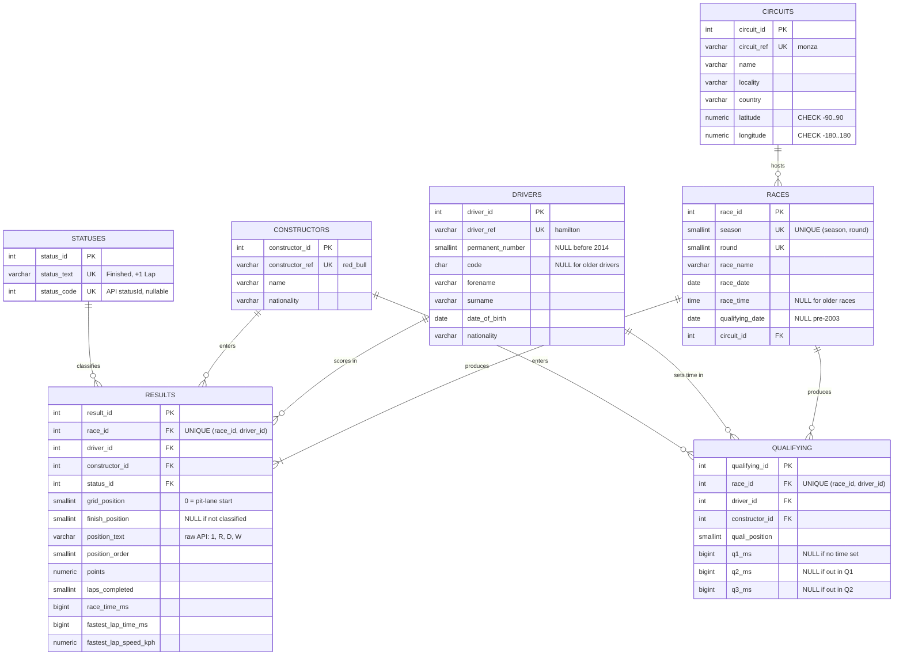
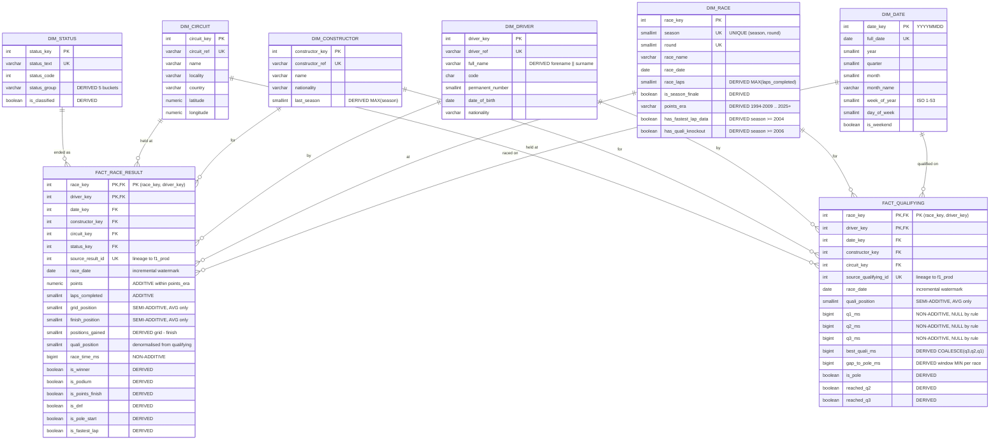

# Technical reference

Detailed design notes behind the [project README](../README.md): full schemas, module
responsibilities, the analytics layer, the indexing measurements and the design decisions worth
defending. The README stands on its own; this document is for a reader who wants the reasoning.

## Contents

- [OLTP schema (`f1_prod`)](#oltp-schema-f1_prod)
- [Warehouse schema (`f1_dw`)](#warehouse-schema-f1_dw)
- [Pipeline modules](#pipeline-modules)
- [Analytics views](#analytics-views)
- [Indexing measurements](#indexing-measurements)
- [Dashboard implementation](#dashboard-implementation)
- [Design decisions](#design-decisions)

## OLTP schema (`f1_prod`)

Seven tables in third normal form. Every table carries a surrogate `SERIAL` primary key and a
`UNIQUE` natural key. The natural key is the `ON CONFLICT` target that makes every load idempotent;
the surrogate key is what the foreign keys point at.

`RACES ||--|{ RESULTS` is one-or-more rather than zero-or-more, and the loader enforces it rather
than the DDL: a scheduled season lists future rounds that have no results yet, and
`load_races(run_keys=...)` holds them back until they have been run, so a race row never exists
without at least one result. Every other relationship is zero-or-more, since a driver or circuit
can exist in the reference data without yet appearing in a race.

`chk_results_finish` enforces that `finish_position` is NULL exactly when `position_text` is
non-numeric, so "did not finish" cannot disagree with itself. `check_oltp` reasserts the same rule
after every load, which would catch the constraint having been dropped.

The `/status` endpoint does not return every status string that appears in a result, so the loader
calls `load_statuses` a second time with the statuses observed in the parsed results. Without it,
those result rows would fail their status foreign key and be skipped.

## Warehouse schema (`f1_dw`)

Six dimensions and two facts. `DERIVED` marks an attribute computed at load time so that queries do
not have to recompute it.

Two details the diagram is deliberately showing. `circuit_key` sits on both facts rather than on
`dim_race`; putting it on `dim_race` would snowflake the model and make every circuit query a
two-hop join. And the grain is declared as a composite primary key, so a duplicate load is rejected
by the database rather than merely avoided by the ETL.

Dimensions hold participating entities only, filtered with `WHERE EXISTS`: 177 of 881 drivers and
49 of 214 constructors, plus one seeded unknown member each. The excluded rows are entities whose
entire career falls outside 1994-2026, because the API's reference endpoints are all-time.

## Pipeline modules

`etl/olap/` splits into four modules with one responsibility each: extract decides which rows,
transform decides which columns, quality asserts the promise, load writes.

| Module | Responsibility |
|---|---|
| `extract.py` | Reads `f1_prod`. Derives every dimension attribute in SQL, so each dimension is one self-contained query and needs no transform step. |
| `transform.py` | Facts only: resolves surrogate keys, computes derived measures and the pre-computed flags. |
| `quality.py` | Returns verdicts and never repairs. A gate that quietly drops a bad row makes its own check unfalsifiable. |
| `load.py` | Upserts on natural and source keys, so a second run updates in place. |

The full qualifying set is read even on an incremental run, because it feeds the `quali_position`
denormalized onto the race fact. The two facts have independent watermarks whose windows can drift
apart, so without it a reprocessed result row could overwrite a correct `quali_position` with NULL.

The Airflow warehouse DAG imports the same `etl.olap` modules rather than shelling out to
`scripts/pipeline.py`, which leaves two callers of the same code that can drift. They are kept
deliberately parallel, same call order and same arguments. Every function in `etl/` takes an open
connection as its first argument and never opens or closes it, which is why the same code runs from
a script and from a task. Airflow supplies its connections through `AIRFLOW_CONN_*`, so the DAGs
never read `POSTGRES_HOST`.

Extract, transform, gate and load run in a single Airflow task on purpose. The four stages hand
tens of thousands of rows to each other in memory, and splitting them across tasks would push that
through XCom, which is a column in Airflow's metadata database rather than a data channel.

`docker-compose.airflow.yml` pins `name: f1-airflow`. Compose otherwise derives a project name from
the directory, which would make it the same project as `docker-compose.yml`; since both define a
`postgres` service, starting Airflow would replace the F1 database container with Airflow's
metadata database.

## Analytics views

| View | Question | Technique |
|---|---|---|
| `v_season_kpis` | What does a season look like at a glance? | Flag sums, one scan, no `CASE` |
| `v_constructor_season` | Is the sport competitive or dominated? | Season by constructor grain |
| `v_driver_season` | Who won it, and what was their season made of? | Season by driver, disjoint outcome buckets |
| `v_championship_progression` | Who led the title race, and when did it turn? | `SUM() OVER (PARTITION BY season, driver ORDER BY round)` |
| `v_driver_rolling_form` | Is a driver trending up or down? | `ROWS BETWEEN 4 PRECEDING AND CURRENT ROW` |
| `v_reliability_trend` | How did cars finish over 33 seasons? | Aggregate nested in a window |
| `v_quali_vs_race` | Both facts on their shared grain | `INNER JOIN` on `(race_key, driver_key)` |
| `v_driver_race_craft` | Who gains places against par for the grid slot? | Residual against a per-grid-slot baseline |
| `v_season_competitiveness` | How dominant was the strongest team? | Win share, comparable across scoring eras |
| `v_circuit_profile` | Which circuits break cars? | The query that earns `dim_circuit` |

`v_driver_race_craft` is the one worth a second look. Plotting places gained directly is close to
meaningless: averaged over 2020-2026 it runs about -1.2 at pole and +5.3 from P20, near perfectly
monotonic, because pole cannot gain a place and last cannot lose one. A raw ranking therefore
mostly sorts drivers by how slow their car is over one lap. Subtracting par for the grid slot,
computed within the season, leaves a residual that reorders the field, which is the test that it
does something. The residuals sum to zero within a season, so the baseline checks itself. The
residual is still not pure driver skill: car pace, strategy, reliability and race incidents all
remain in it.

`v_constructor_season` exists because the KPI cards need a season grain while the constructor chart
needs a constructor grain, and one view cannot be both without a `groupby` in the dashboard.
`v_driver_season` is its mirror at driver grain.

`v_season_competitiveness` measures dominance in wins rather than points. The scoring system
changed across four scoring eras in scope, so a points share means something different in each era while a race
win does not. The per-season denominator comes from `SUM(wins) OVER (PARTITION BY season)`, which is
exact because every race has precisely one winner.

## Indexing measurements

Seven candidate indexes were created and measured; four were kept. Medians of seven runs after two
warmups, on the 13,006-row fact of the time.

| Query | Before | After | Change |
|---|---:|---:|---:|
| `MAX(race_date)`, the ETL watermark | 1.410 ms | 0.007 ms | ~200x |
| 30-day incremental lookback | 0.548 ms | 0.011 ms | ~50x |
| One driver's whole career | 0.164 ms | 0.019 ms | ~9x |
| One constructor's history | 0.565 ms | 0.150 ms | ~4x |
| `SELECT * FROM v_season_kpis` | 14.534 ms | 14.660 ms | none |
| `SELECT * FROM v_quali_vs_race` | 13.405 ms | 14.005 ms | none |

Postgres indexes primary key and unique constraints only, not foreign-key columns, which is why the
file exists at all.

Two predictions were wrong, which is the argument for measuring rather than reasoning.
`idx_frr_race` looked redundant against the primary key's leading column but became the most-used
index on the table, because it is one column wide against the primary key's two and the planner
prefers the narrower btree. And `idx_fq_race_driver` looked useful at 72 scans until `REINDEX`
shrank the primary key from 512 kB to 264 kB, exactly its size: its whole advantage was accumulated
page-split bloat, so the fix was to reindex rather than keep a permanent second copy of the primary
key in the write path. `sql/analytics/002_indexes.sql` records each rejection with the measurement
that caused it.

## Dashboard implementation

`dashboard/db.py` is the only module that touches Postgres, and the connection is read-only enforced
by the server (`default_transaction_read_only=on`), so an `INSERT` from the dashboard raises rather
than being prevented by convention. There is no SQL in `screens/` or `charts/` and no aggregation in
pandas; the chart modules filter, reshape and encode.

Navigation and filters live in the sidebar, and every figure on a page reads the same selection, so
two charts cannot end up on different slices without saying so.

Colour is validated rather than chosen. The eight categorical series hues clear colour-blind
separation, lightness, chroma and 3:1 contrast against the chart surface. That is why the theme is
pinned in `.streamlit/config.toml`: the palette is only valid against one surface, so the theme and
the charts ship together, and every chart renders with Streamlit's own theme override off so it
cannot repaint the marks.

The reliability chart marks its caveat rather than hiding it. Results carrying a specific
retirement cause run 73 in 2022, 6 in 2023 and 0 in 2024, while generic retirements run 0, 53 and
49. The mechanical and accident bands ending is a reporting change, not cars that stopped breaking.
The total retirement share remains sound across the break; the split into causes does not.

## Design decisions

1. **Dimensions hold participating entities only.** The API's reference endpoints are all-time, so
   an unfiltered load would carry hundreds of entities that never appear in a fact row.
2. **There is no `first_season` or `debut_season`.** `f1_prod` starts at 1994, so `MIN(season)`
   would report 1994 for the 46 drivers and 14 constructors who raced before then. A column is
   left-censored exactly when it asks "when did this start?" of a source that begins mid-history.
3. **Raw points are comparable within an era only.** Stacking points across 33 seasons would add
   ten-point wins to twenty-five-point wins. Cross-era comparison uses the boolean flags, which
   mean the same thing in 1994 as in 2026.
4. **Migrations contain no `INSERT`.** They run once and are then skipped by the ledger, so anything
   they insert would be unrecoverable after a `TRUNCATE`. The unknown members and the `dim_date`
   populate come from `load.py`, so a truncate-and-reload restores a complete warehouse.
5. **Facts conflict on the source id, not the surrogate pair.** Surrogate keys are reassigned if a
   dimension is ever rebuilt, while `source_result_id` is stable and doubles as the lineage trail
   back to `f1_prod`.
